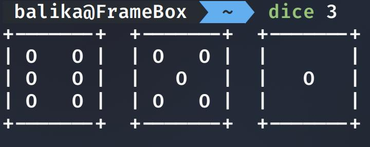

# Dice in C

An improved version of my dice command written in the glorious C language. I wanted to port something over from Java as a first C project because I thought it would be easy. Oh how wrong I was...

## Instructions
Launch from the command line: `./dice`
Multiple dice can be displayed at once with an integer argument immedietly following the `./dice` command: `./dice 9`

### New and improved
Dice now wrap to the next line if a high number is given, but measuring the terminal width and calling the draw function depending on how many dice remain to be drawn

## Example

### Without argument

